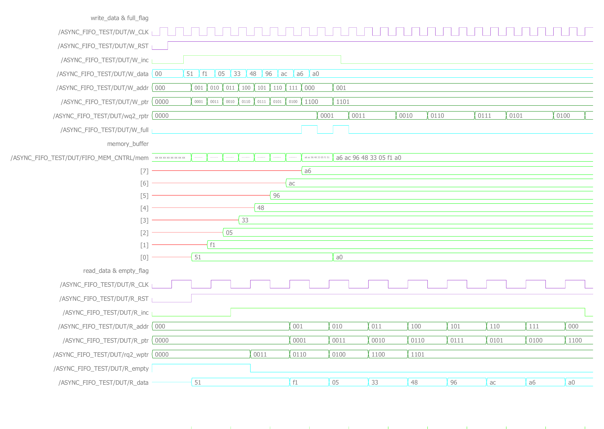

# Async_FIFO — Asynchronous FIFO

A dual-clock asynchronous FIFO (2-port memory) implemented in Verilog, using Gray-code pointer synchronization to safely cross write/read pointers between the two clock domains.

## About the Design

An asynchronous FIFO connects two clock domains: a **write side** (`W_CLK`) and a **read side** (`R_CLK`). Each side keeps its own pointer into a shared dual-port memory. To compare pointers safely across domains without metastability risk, both pointers are encoded in **Gray code** (only one bit changes per increment) before being synchronized into the other domain through a double-flop synchronizer.

Top-level ports (`ASYNC_FIFO`):

| Signal     | Direction | Width           | Description                     |
|------------|-----------|-----------------|-----------------------------------|
| `W_data`   | input     | `data_width`    | Write data bus                    |
| `W_inc`    | input     | 1               | Write enable                      |
| `R_inc`    | input     | 1               | Read enable                       |
| `W_CLK`    | input     | 1               | Write (source) domain clock       |
| `W_RST`    | input     | 1               | Write domain active-low async reset |
| `R_CLK`    | input     | 1               | Read (destination) domain clock   |
| `R_RST`    | input     | 1               | Read domain active-low async reset |
| `R_data`   | output    | `data_width`    | Read data bus                     |
| `W_full`   | output    | 1               | FIFO full flag                    |
| `R_empty`  | output    | 1               | FIFO empty flag                   |

Parameters: `data_width` (default 8), `depth` (default 8), `addr_width` (default 3, must satisfy `depth = 2**addr_width`), `NUM_STAGES` (default 2, synchronizer stages).

## Sub-modules

- [x] **FIFO_wptr** – generates the write address, the Gray-coded write pointer, and the `W_full` flag by comparing against the synchronized read pointer
- [x] **FIFO_rptr** – generates the read address, the Gray-coded read pointer, and the `R_empty` flag by comparing against the synchronized write pointer
- [x] **DF_SYNC** – double-flop synchronizer used to safely pass each Gray-coded pointer into the other clock domain (instantiated twice: `DF_SYNC_R` and `DF_SYNC_W`)
- [x] **FIFO_MEM_CNTRL** – the dual-port memory array itself (written on `W_CLK` when `W_inc & !W_full`, read combinationally through `R_addr`)
- [x] **ASYNC_FIFO** – top-level module wiring the above together
- [x] Testbench (write clock 10 ns / read clock 25 ns, 9 data bytes)

### FIFO_wptr

`module FIFO_wptr #(parameter addr_width = 3) (...)`

| Signal      | Direction | Width           | Description                                  |
|-------------|-----------|-----------------|-------------------------------------------------|
| `W_inc`     | input     | 1               | Write enable                                    |
| `W_CLK`     | input     | 1               | Write domain clock                              |
| `W_RST`     | input     | 1               | Write domain active-low async reset             |
| `wq2_rptr`  | input     | `addr_width+1`  | Read pointer, synchronized into the write domain|
| `W_addr`    | output    | `addr_width`    | Write address (binary, into the memory)         |
| `W_ptr`     | output    | `addr_width+1`  | Write pointer (Gray-coded, registered)          |
| `W_full`    | output    | 1               | FIFO full flag                                  |

### FIFO_rptr

`module FIFO_rptr #(parameter addr_width = 3) (...)`

| Signal      | Direction | Width           | Description                                  |
|-------------|-----------|-----------------|-------------------------------------------------|
| `R_inc`     | input     | 1               | Read enable                                     |
| `R_CLK`     | input     | 1               | Read domain clock                               |
| `R_RST`     | input     | 1               | Read domain active-low async reset              |
| `rq2_wptr`  | input     | `addr_width+1`  | Write pointer, synchronized into the read domain|
| `R_addr`    | output    | `addr_width`    | Read address (binary, into the memory)          |
| `R_ptr`     | output    | `addr_width+1`  | Read pointer (Gray-coded, registered)           |
| `R_empty`   | output    | 1               | FIFO empty flag                                 |

### FIFO_MEM_CNTRL

`module FIFO_MEM_CNTRL #(parameter data_width = 8, depth = 8, addr_width = 3) (...)`

| Signal     | Direction | Width         | Description                                    |
|------------|-----------|---------------|---------------------------------------------------|
| `W_data`   | input     | `data_width`  | Write data                                        |
| `W_inc`    | input     | 1             | Write enable                                      |
| `W_full`   | input     | 1             | FIFO full flag (gates the write)                  |
| `W_addr`   | input     | `addr_width`  | Write address                                     |
| `W_CLK`    | input     | 1             | Write domain clock                                |
| `R_addr`   | input     | `addr_width`  | Read address                                      |
| `R_data`   | output    | `data_width`  | Read data (combinational read)                    |

### DF_SYNC

`module DF_SYNC #(parameter data_width = 4, NUM_STAGES = 2) (...)`

| Signal        | Direction | Width         | Description                                  |
|---------------|-----------|---------------|-------------------------------------------------|
| `CLK`         | input     | 1             | Destination domain clock                        |
| `RST`         | input     | 1             | Destination domain active-low async reset       |
| `unsync_bus`  | input     | `data_width`  | Unsynchronized bus (source domain)              |
| `sync_bus`    | output    | `data_width`  | Synchronized bus (destination domain)           |

## Repository Structure

```
rtl/            → design source files (top + 4 sub-modules)
tb/             → testbench and simulation scripts
docs/images/    → simulation waveform
```

## Simulation Results

The testbench writes 9 bytes (`depth = 8`) while reads run concurrently on a slower, independent clock (write period 10 ns, read period 25 ns) — a simple functional check of the write/read handshake and the `W_full`/`R_empty` flags across the two clock domains.

`W_full` pulses briefly once the write pointer catches up to the (synchronized) read pointer after the 8th write. Because reads are already progressing on their own clock, address `000` is freed by the time the 9th byte (`0xa0`) is written, so it correctly overwrites the oldest slot instead of being dropped — `R_data` then streams out all 9 bytes in order (`51, f1, 05, 33, 48, 96, ac, a6, a0`).



## Tools Used

- Simulation: ModelSim/QuestaSim
